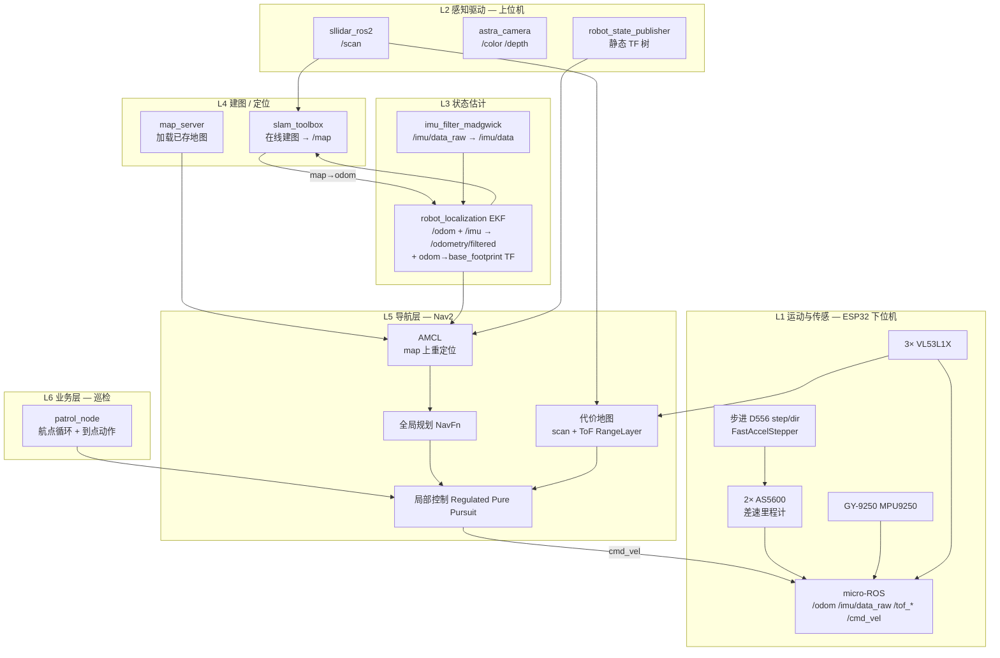

# 室内巡检小车 — 项目复盘文档

> 最后更新：2026-06-28  
> 目标：室内自动巡检（建图 → 定位 → 自主导航 → 航点巡逻 + 到点动作）  
> 策略：室内车稳扎稳打；室外另建小车（S2L + Gemini 336L），本文档聚焦**室内车**。

---

## 1. 项目总览

### 1.1 两条产品线

| 平台 | 状态 | 传感器 | 下位机 | 上位机软件包 |
|------|------|--------|--------|--------------|
| **旧 deck 小车**（Arduino + 直流 + Astra Pro） | 已跑通建图 | Astra Pro | Arduino UNO (`mobile_base`) | `mobile_base` + RTAB-Map |
| **新室内巡检车**（步进 + ESP32） | 软件骨架 ready，硬件未到 | A1 + Astra Pro + GY-9250 + 3×VL53L1X + 2×AS5600 | ESP32 WROOM (`esp32_base`) | `indoor_bringup` + Nav2 + 巡检脚本 |

本文档以**新室内巡检车**为主线；旧车保留作对照/开发台。

### 1.2 设计原则

- **分层解耦**：下位机只管实时运动与原始传感；上位机做融合、建图、导航、业务。
- **传感器互补**：轮速（短期平移/旋转）+ IMU（抗振/偏航）+ 激光（2D 导航骨架）+ 深度相机（后续 3D/视觉）+ ToF（补激光盲区）。
- **先 2D 激光建图/导航**：室内用 `slam_toolbox` + Nav2 最稳；RTAB-Map 旧链路仍可用于旧车或后续 3D 增强。

---

## 2. 系统分层架构



### 2.1 坐标系（REP-103）

| 帧名 | 含义 |
|------|------|
| `map` | 全局地图系（slam_toolbox / AMCL 发布 `map→odom`） |
| `odom` | 里程计系（EKF 发布 `odom→base_footprint`） |
| `base_footprint` | 地面投影原点（两轮中心中点） |
| `base_link` | 车体刚体 |
| `laser` | A1 雷达 |
| `camera_*` | Astra Pro 各光学/深度帧 |
| `imu_link` | GY-9250 |
| `tof_front/left/right_link` | VL53L1X |

完整 TF 链（导航时）：

```
map → odom → base_footprint → base_link → {laser, camera_*, imu_link, tof_*}
```

---

## 3. 各层算法与软件说明

### L1 — ESP32 下位机固件 (`esp32_base/`)

**路径**：`esp32_base/`（PlatformIO + micro-ROS）

**职责**：

| 功能 | 实现 | 输出话题 |
|------|------|----------|
| 差速运动 | `/cmd_vel` → 逆运动学 → 左右轮线速度 → 步频 | 订阅 `/cmd_vel` |
| 轮速里程计 | 2× AS5600 绝对角度差分 → 差速积分 | `/odom`（**不发 TF**，交给 EKF） |
| IMU | MPU9250 原始六轴 | `/imu/data_raw` |
| 近距测距 | 3× VL53L1X（XSHUT 改址） | `/tof_front`, `/tof_left`, `/tof_right` |
| 通信 | micro-ROS serial + agent | 与笔记本 ROS2 域桥接 |

**双核分工**：

- **Core 0 `controlTask`（100 Hz）**：读编码器、积分里程计、读 IMU/ToF、执行 `/cmd_vel`（超时 500 ms 急停）。
- **Core 1 `microRosTask`**：micro-ROS 发布/订阅 + agent 断连重连 + 时钟同步。

**关键设计**：

- 步进**开环驱动**（D556 step/dir）；AS5600 只用于**测量真实轮转**和里程计，不闭环纠步。
- AS5600 地址固定 `0x36` → **两路 I2C** 各挂一个轮子编码器。
- VL53L1X 默认均 `0x29` → 上电用 **XSHUT** 逐个使能并改址为 `0x30/0x31/0x32`。
- 编码器带**正交方向**（角度差分），不再像旧 Arduino 方案那样靠指令符号猜方向。

**配置**：`esp32_base/include/config.h`（引脚、轮径、轮距、微步、减速比等，**大量 TODO 待实车填写**）。

**状态**：骨架已写；**未在实机编译/烧录/联调**。

---

### L2 — 感知与机器人描述 (`indoor_bringup`)

**包路径**：`ros2_ws/src/indoor_bringup/`

#### 2.1 机器人模型 — `urdf/indoor_robot.urdf`

- 定义 `base_footprint`、`base_link`、驱动轮、`laser`、`camera_*`、`imu_link`、3 个 `tof_*_link`。
- 相机光学帧（`rpy="-π/2 0 -π/2"`）已写入 URDF；Astra 驱动 `publish_tf:=false`，避免重复 TF。
- **尺寸均为占位**，需实车测量后改 URDF 并与 `config.h` 同步。

#### 2.2 传感器驱动 — `launch/sensors.launch.py`

| 传感器 | 驱动 | 话题 | 参数 |
|--------|------|------|------|
| RPLIDAR A1 | `sllidar_ros2` / `sllidar_node` | `/scan` | 串口默认 `/dev/ttyUSB0`，115200 |
| Orbbec Astra Pro | `astra_camera`（`orbbec_ws`） | `/camera/color/*`, `/camera/depth/*` | `publish_tf:=false` |

> **依赖**：`sllidar_ros2` 需源码 clone 到 `ros2_ws/src`；`astra_camera` 在 `orbbec_ws` 中 build。

#### 2.3 描述 launch — `launch/description.launch.py`

- `robot_state_publisher`：URDF → `/robot_description` + 静态 TF。
- `joint_state_publisher`：轮关节占位（ESP32 将来可发 `/joint_states` 替代）。

---

### L3 — 状态估计（传感器融合）

**Launch**：`launch/localization.launch.py`  
**配置**：`config/ekf.yaml`

**数据流**：

```
ESP32 /imu/data_raw
    → imu_filter_madgwick (use_mag:=false 默认)
    → /imu/data
         ↘
ESP32 /odom ──→ robot_localization EKF ──→ /odometry/filtered
                                         └── TF: odom → base_footprint
```

**EKF 融合策略（2D 平面车）**：

| 输入 | 融合量 | 说明 |
|------|--------|------|
| `/odom` | `vx`, `vyaw` | 轮速信平移与角速度 |
| `/imu/data` | `vyaw`（差分 yaw） | 无磁力计模式；抗振、平滑旋转 |

**为何不默认用磁力计**：GY-9250 虽有 AK8963，但室内靠近步进电机/钢底盘时磁航向不可靠。可选：`use_mag:=true` + 修改 `ekf.yaml` 中 `imu0_differential: false`（需硬/软铁标定）。

**与 bringup 的关系**：`bringup.launch.py` 中 `use_ekf:=true` 会 include 本 launch；`use_fake_odom:=true` 时发 identity 的 `odom→base_footprint`（仅调试传感器/建图，无真实底盘）。

---

### L4 — 建图与地图

#### 4.1 在线建图 — `slam_toolbox`

**Launch**：`launch/slam.launch.py`  
**配置**：`config/slam_toolbox.yaml`

- **算法**：2D 激光 SLAM（scan matching + 回环 + 位姿图优化）。
- **输入**：`/scan`（A1）+ `odom→base_footprint`（真实 EKF 或 fake）。
- **输出**：`/map`（占用栅格）+ TF `map→odom`。
- **模式**：`mode: mapping`（建图）；导航阶段改用 AMCL + 已存地图，**不要与 slam_toolbox 同时开**。

#### 4.2 分层建图融合（A1 + Astra + VL53L1X）— **新增**

**Launch**：`mapping.launch.py`（全栈） / `mapping_layers.launch.py`（仅扫描层）  
**配置**：`config/mapping_layers.yaml`

| 层 | 节点 | 输出话题 | 作用 |
|----|------|----------|------|
| Lidar | A1 驱动 | `/scan` | 2D 主骨架 |
| Depth | `depth_scan_layer_node` | `/mapping/layers/depth_scan` | Astra 深度，z 带过滤（默认 0.05–0.40 m）→ 伪 LaserScan |
| ToF | `tof_scan_layer_node` | `/mapping/layers/tof_scan` | 3×VL53L1X 合并稀疏 scan |
| Fusion | `scan_fusion_node` | `/scan_fused` | 各层按角度 bin **取最小距离**合并 |
| SLAM | `slam_toolbox` | `/map` | 输入 `scan_topic`=`/scan_fused` 或 `/scan` |

**分层调试 launch 参数**：

| 参数 | 默认 | 说明 |
|------|------|------|
| `use_layer_depth` | true | 开/关 Astra 深度层 |
| `use_layer_tof` | true | 开/关 ToF 层（需 ESP32 发 `/tof_*`） |
| `use_fusion` | true | 开/关融合；false 时 SLAM 用 `/scan` |
| `slam` | true | 是否启动 slam_toolbox |

**推荐一键建图**：

```bash
ros2 launch indoor_bringup mapping.launch.py lidar_port:=/dev/ttyUSB0 \\
  use_fake_odom:=false use_ekf:=true
```

**分层调试示例**：

```bash
# 仅 A1
ros2 launch indoor_bringup mapping.launch.py use_layer_depth:=false use_layer_tof:=false use_fusion:=false

# 仅看深度层（RViz: mapping_layers.rviz）
ros2 launch indoor_bringup mapping.launch.py use_layer_tof:=false use_fusion:=false slam:=false
```

RViz 配置 `rviz/mapping_layers.rviz` 同时显示四层 LaserScan（红/蓝/黄/绿）+ `/map`。

**保存地图**：

```bash
ros2 run nav2_map_server map_saver_cli -f ~/maps/indoor
```

#### 4.3 旧车 RTAB-Map 链路（参考）

旧 deck 小车使用 `mobile_base/mobile_mapping.launch.py` + RTAB-Map（RGB-D + 轮速），见 `run_mobile_mapping.sh`。新室内车主线改为 **2D 激光 + slam_toolbox**；Astra Pro 可在后续作为 3D/视觉增强叠加。

---

### L5 — 自主导航（Nav2）

**Launch**：
- `launch/navigation.launch.py` — **推荐**：description + sensors + EKF + 可选 depth_scan + Nav2 一键
- `launch/nav2.launch.py` — 仅 Nav2（需自行起传感器）

**配置**（`navigation.launch.py` 按开关自动选文件）：

| `use_nav_depth` | `use_nav_tof` | 参数文件 | local_costmap 源 |
|-----------------|---------------|----------|------------------|
| false | false | `nav2_params_lidar_only.yaml` | `/scan` |
| true | false | `nav2_params_no_tof.yaml` | `/scan` + depth_scan |
| false | true | `nav2_params_tof_only.yaml` | `/scan` + `/tof_*` |
| true | true | `nav2_params.yaml` | 三路全开 |

**组件**：

| 节点 | 作用 |
|------|------|
| `map_server` | 加载 `~/maps/indoor.yaml` |
| `amcl` | 粒子滤波，在已知地图上重定位，发布 `map→odom` |
| `controller_server` | **Regulated Pure Pursuit**（差速车推荐） |
| `planner_server` | NavFn 全局路径 |
| `behavior_server` | 恢复行为（spin / backup 等） |
| `bt_navigator` | 行为树导航 |
| `waypoint_follower` | Nav2 内置航点（到点停 2s） |
| `velocity_smoother` | 平滑速度，输出最终 `/cmd_vel` |

**速度链路**：

```
controller → cmd_vel_nav → velocity_smoother → /cmd_vel → ESP32
```

**代价地图**：

- **全局**：静态地图 + `/scan` 障碍 + 膨胀。
- **局部（滚动窗口）**：按上表融合 live 传感器 + 膨胀：
  - `/scan` — A1（mark + clear）
  - `/mapping/layers/depth_scan` — Astra 低高度带（`depth_scan_layer_node`，仅 mark）
  - `/tof_front|left|right` — ESP32 `RangeSensorLayer`（补激光平面以下/侧向盲区）
  - `/perception/person_scan` — **可选** `person_tracker_node`（YOLO + Kalman，见 `use_nav_person`）

### L5b — 行人检测追踪（可选）

**Launch**：`launch/person_tracker.launch.py`（或由 `navigation.launch.py use_nav_person:=true` 拉起）

**节点**：`person_tracker_node`  
**配置**：`config/person_tracker.yaml`

| 步骤 | 实现 |
|------|------|
| 检测 | `detection_mode:=internal` → Ultralytics YOLOv8（COCO person）；`external` → 订阅 `vision_msgs/Detection2DArray`（ros2_yolo / depthai 桥接） |
| 地面占位 | bbox 底边 + Astra depth → `base_footprint` (x, y) |
| 追踪 | 2D 恒速 Kalman + 最近邻关联 |
| 可视化 | `/perception/person_markers`（圆柱=当前、黄盘=预测、箭头=速度） |
| Nav2 | `/perception/person_scan` → `local_costmap` `person_scan` 观测源（mark-only，含预测位置） |

**依赖**（internal 模式）：

```bash
pip install ultralytics
sudo apt install ros-humble-vision-msgs   # external 模式也需要
```

**Launch 参数**：

| 参数 | 默认 | 说明 |
|------|------|------|
| `use_nav_person` | `false` | `navigation.launch.py` 总开关 |
| `person_detection_mode` | `internal` | `internal` / `external` |
| `person_model_path` | `yolov8n.pt` | YOLO 权重 |
| `publish_scan` | `true` | 是否写入 Nav2 costmap |

**控制器速度范围**（需与底盘能力一致，当前占位）：

- 期望线速度 ~0.25 m/s；最大 ~0.4 m/s；旋转 ~0.8 rad/s。
- 实车需按步进死区/最大速微调 `nav2_params.yaml`。

**里程计话题**：Nav2 使用 `/odometry/filtered`（EKF 输出），故跑 Nav2 时**必须同时开 EKF**。

---

### L6 — 巡检业务层

**节点**：`indoor_bringup/patrol_node.py`  
**Launch**：`launch/patrol.launch.py`  
**航点配置**：`config/patrol_waypoints.yaml`

**逻辑**：

1. 等待 Nav2 active（`waitUntilNav2Active`）。
2. 按 YAML 中 `waypoints` **逐点** `goToPose`（到一点、做动作、再去下一点）。
3. 到点动作（可扩展）：
   - `wait`：停留 `dwell_s` 秒；
   - `capture`：发布 `/patrol/capture_request`（预留接相机存图）；
   - `log`：仅日志。
4. 支持 `loop`、`max_rounds`、每轮回 `home`、导航失败重试、单点超时。

**与 Nav2 `waypoint_follower` 的区别**：Nav2 内置 follower 偏通用；`patrol_node` 是**业务层**，负责循环路线 + 自定义巡检动作。

---

## 4. 旧 deck 小车（`mobile_base`）— 已完成工作摘要

| 项 | 说明 |
|----|------|
| 底盘 | Arduino UNO + L298N/PID 固件，串口 CSV 遥测 |
| 里程计 | `arduino_base_node.py`，单通道编码器（方向靠指令推断） |
| 阶段 0 | 新增 `w R L` 差速命令 + `cmd_vel` 逆运动学（待新 ESP32 固件替代） |
| 建图 | RTAB-Map + Astra Pro RGB-D + 轮速，见 `run_mobile_mapping.sh` |
| 包 | `ros2_ws/src/mobile_base/`（**不动**，与新 `indoor_bringup` 隔离） |

---

## 5. 仓库目录结构

```
orbbec_astro_pro/
├── docs/
│   └── INDOOR_INSPECTION_ROBOT.md     ← 本文档
├── esp32_base/                        ← 新下位机 PlatformIO + micro-ROS
│   ├── platformio.ini
│   ├── include/config.h
│   └── src/main.cpp
├── orbbec_ws/                         ← Astra 相机驱动
│   └── src/ros2_astra_camera/
├── ros2_ws/src/
│   ├── indoor_bringup/                ← 新室内车上位机（主文档对象）
│   ├── mobile_base/                   ← 旧 Arduino 车
│   └── astra_pro_slam/                ← 旧 SLAM 辅助节点
├── Adruino_PID-full/PID-full.ino      ← 旧 Arduino 固件
└── run_mobile_mapping.sh              ← 旧车一键建图
```

---

## 6. 硬件清单与接线

### 6.1 室内车已购硬件

| 部件 | 型号/数量 | 用途 |
|------|-----------|------|
| 2D 激光 | RPLIDAR A1 ×1 | `/scan`，建图/Nav2 |
| 深度相机 | Orbbec Astra Pro ×1 | RGB-D（建图增强/巡检拍照） |
| IMU | GY-9250 (MPU9250) ×1 | `/imu/data_raw` |
| 磁编码器 | AS5600 ×2 + 径向磁铁 ×2 | 轮速里程计（带方向） |
| ToF | VL53L1X ×3 | 近场/防跌落，Nav2 RangeLayer |
| 电机 | 步进 ×2 + D556 驱动 ×2 | 差速底盘 |
| 主控 | ESP32 WROOM 28pin ×1 | 下位机 |
| 上位机 | 笔记本 | ROS2 Humble |

### 6.2 建议补购

- 电池 + 电机电源（24–36V 视电机）、DC-DC 降压 5V、**公共地线汇流**
- **急停开关**（切断电机电源）
- 有源 **USB3 Hub**（A1 + Astra + ESP32）
- 万向轮、联轴器、AS5600 安装支架（3D 打印）
- （备用）3.3→5V 电平转换（D556 光耦若 3.3V 触发不稳）

### 6.3 接线表（与 `config.h` 一致）

#### 电源

| 来源 | 接到 |
|------|------|
| 电机电源 24–36V | 两个 D556 的 V+/V- |
| 5V（buck 或 USB） | ESP32、A1、传感器 |
| **GND 共地** | 电机电源 GND、D556 GND、ESP32 GND、所有传感器 GND **必须相连** |

#### 步进 D556 ×2（共阴极，信号 3.3V）

| D556 信号 | 右电机 | 左电机 |
|-----------|--------|--------|
| PUL+ | GPIO **25** | GPIO **27** |
| DIR+ | GPIO **26** | GPIO **14** |
| ENA+ | GPIO **13**（两驱动并联） | 同左 |
| PUL-/DIR-/ENA- | ESP32 GND | GND |

电机相线：A+/A-、B+/B- 接步进电机两相。

> 若 3.3V 无法可靠触发：加电平转换，或改共阳极接法（PUL+/DIR+/ENA+ 接 +5V，负端接 GPIO，并翻转 `*_DIR_INVERT`）。

#### I2C 总线 0 — Wire（SDA=**21**, SCL=**22**, 3.3V, GND）

| 设备 | 地址 | 备注 |
|------|------|------|
| AS5600 右轮 | 0x36 | 模块 DIR→GND 定方向 |
| GY-9250 | 0x68 | AD0→GND |
| VL53L1X ×3 | 上电 0x29 → 改 0x30/0x31/0x32 | 见 XSHUT |

#### I2C 总线 1 — Wire1（SDA=**18**, SCL=**19**, 3.3V, GND）

| 设备 | 地址 |
|------|------|
| AS5600 左轮 | 0x36（故必须独立总线） |

#### VL53L1X XSHUT

| 传感器 | XSHUT → GPIO |
|--------|--------------|
| 前 | **4** |
| 左 | **5** |
| 右 | **23** |

#### AS5600 机械安装

- 芯片上方 **0.5–2 mm** 处贴 **径向充磁磁铁**（与轴同心）。
- 偏心与气隙过大 → 读数乱跳。

#### 其他 USB 设备

| 设备 | 连接 |
|------|------|
| A1 | USB 转串口 → 笔记本（常见 `/dev/ttyUSB0`） |
| Astra Pro | USB3 → 笔记本 |
| ESP32 | USB → 笔记本（micro-ROS agent 占用，**勿与 monitor 同时开**） |

---

## 7. 软件依赖安装（一次性）

```bash
# ROS2 基础（假设已装 Humble）
sudo apt install \
  ros-humble-robot-localization \
  ros-humble-imu-filter-madgwick \
  ros-humble-nav2-bringup

# micro-ROS agent（Humble 无 apt 包，需源码编译一次）
sudo apt install python3-vcstool flex bison libasio-dev
pip install --user vcstool   # 若 apt 未装 vcstool
mkdir -p ~/microros_ws/src && cd ~/microros_ws/src
git clone -b humble https://github.com/micro-ROS/micro_ros_setup.git
cd ~/microros_ws
source /opt/ros/humble/setup.bash
rosdep install --from-paths src --ignore-src -y
colcon build
source install/local_setup.bash
ros2 run micro_ros_setup create_agent_ws.sh
ros2 run micro_ros_setup build_agent.sh
# 以后每个终端：source ~/microros_ws/install/local_setup.bash
# 或直接用：~/Documents/orbbec_astro_pro/scripts/run_microros_agent.sh

# A1 驱动（源码）
cd ~/Documents/orbbec_astro_pro/ros2_ws/src
git clone https://github.com/Slamtec/sllidar_ros2.git

# 编译
cd ~/Documents/orbbec_astro_pro/ros2_ws
colcon build --packages-select indoor_bringup sllidar_ros2
source install/setup.bash

# Orbbec 相机（若未 build）
cd ~/Documents/orbbec_astro_pro/orbbec_ws && colcon build
source install/setup.bash

# PlatformIO（ESP32 固件）
pip install platformio
```

---

## 8. 软件运行步骤（按阶段）

### 8.0 环境 source（每个终端）

```bash
source /opt/ros/humble/setup.bash
source ~/Documents/orbbec_astro_pro/orbbec_ws/install/setup.bash
source ~/Documents/orbbec_astro_pro/ros2_ws/install/setup.bash
```

### 8.1 阶段 A — ESP32 固件首通（硬件到后第一步）

```bash
# 1) 填 config.h 全部 TODO，编译烧录
cd ~/Documents/orbbec_astro_pro/esp32_base
pio run -t upload

# 2) 起 micro-ROS agent（占用 ESP32 串口）
ros2 run micro_ros_agent micro_ros_agent serial --dev /dev/ttyACM0 -b 115200

# 3) 验证话题
ros2 topic list
ros2 topic echo /odom --once
ros2 topic echo /imu/data_raw --once
```

标定方向：手转轮子看 `/odom` → 改 `*_ENC_INVERT`；小速度 `/cmd_vel` → 改 `*_DIR_INVERT`。

### 8.2 阶段 B — 里程计标定

- 直线 2 m → 修正 `WHEEL_DIAMETER_M` 与 URDF 轮半径。
- 原地转 10 圈 → 修正 `WHEEL_SEPARATION_M` 与 URDF 轮距。
- 1 m×1 m 方形闭合验证。

### 8.3b 阶段 C′ — Gazebo 仿真（硬件未到 / Nav2+深度+ToF 闭环）

**依赖**（一次性）：

```bash
sudo apt install ros-humble-ros-gz-sim ros-humble-ros-gz-bridge ros-humble-ros-gz-image \\
  ros-humble-gz-ros2-control ros-humble-controller-manager \\
  ros-humble-diff-drive-controller ros-humble-joint-state-broadcaster ros-humble-xacro
```

**仿真内容**（`urdf/indoor_robot.gazebo.xacro` + `worlds/indoor_sim.sdf`）：

| 实机 | Gazebo |
|------|--------|
| ESP32 `/odom` | `diff_drive_controller` + `/cmd_vel` 闭环 |
| A1 `/scan` | `gpu_lidar` 720 点 |
| Astra RGB-D | `rgbd_camera` 640×480 → `/camera/color/*`, `/camera/depth/*` |
| MPU9250 | `imu` → `/imu/data_raw` |
| VL53L1X ×3 | 窄束 lidar → `gazebo_tof_range_node` → `/tof_*` |

**Nav2 闭环**（默认地图 `maps/sim_lab.yaml`，与仿真房间对齐）：

```bash
cd ~/Documents/orbbec_astro_pro/ros2_ws
source /opt/ros/humble/setup.bash
source install/setup.bash
ros2 launch indoor_bringup simulation.launch.py stack:=navigation
# 默认 headless:=true（无 Gazebo 窗口，用 RViz）；要看 3D 场景再加 headless:=false
```

**slam_toolbox 建图**：

```bash
ros2 launch indoor_bringup simulation.launch.py stack:=mapping headless:=true
```

**常用参数**：

| 参数 | 默认 | 说明 |
|------|------|------|
| `stack` | `navigation` | `navigation` / `mapping` |
| `headless` | `false` | `true` 时不弹 Gazebo GUI |
| `use_nav_depth` / `use_nav_tof` | `true` | 与实机相同，测 layered costmap |
| `use_nav_person` | `false` | 可选 YOLO 行人层 |

仅启 Gazebo + 桥接（不带 Nav2）：`ros2 launch indoor_bringup gazebo.launch.py`

### 8.3 阶段 C — 传感器 + 建图（M3–M4）

**终端 1 — 建图（可先 fake odom 手推车验证 scan/TF）**：

```bash
ros2 launch indoor_bringup bringup.launch.py \
  lidar_port:=/dev/ttyUSB0 \
  use_fake_odom:=true    # 无底盘时用；有 ESP32 后改 false
```

**有 ESP32 后**：

```bash
# 终端 1：agent
ros2 run micro_ros_agent micro_ros_agent serial --dev /dev/ttyACM0 -b 115200

# 终端 2：建图 + EKF
ros2 launch indoor_bringup bringup.launch.py \
  lidar_port:=/dev/ttyUSB0 \
  use_fake_odom:=false \
  use_ekf:=true
```

遥控推车走一圈，保存地图：

```bash
ros2 run nav2_map_server map_saver_cli -f ~/maps/indoor
```

### 8.4 阶段 D — 自主导航（M5）

**不要**同时开 `slam_toolbox` 与 AMCL。

**推荐 — 一键导航**（A1 + 可选深度 + 可选 ToF → `local_costmap`）：

```bash
# 终端 1：agent（ESP32，提供 /odom /imu /tof_*）
ros2 run micro_ros_agent micro_ros_agent serial --dev /dev/ttyACM0 -b 115200

# 终端 2：description + sensors + EKF + depth_scan_layer + Nav2 + RViz
ros2 launch indoor_bringup navigation.launch.py \
  map:=$HOME/maps/indoor.yaml \
  lidar_port:=/dev/ttyUSB0 \
  use_fake_odom:=false use_ekf:=true \
  use_nav_depth:=true use_nav_tof:=true use_nav_person:=true
```

**行人追踪**（需 `pip install ultralytics`，CPU/GPU 负载较高，默认关闭）：

```bash
ros2 launch indoor_bringup navigation.launch.py \
  map:=$HOME/maps/indoor.yaml use_nav_person:=true \
  person_detection_mode:=internal
# 或 external + ros2_yolo:
# person_detection_mode:=external  （检测话题 /perception/detections）
```

**A/B 对比动态避障**（只改 `local_costmap` 观测源，global 仍用 `/scan` + 静态地图）：

| 模式 | 命令 |
|------|------|
| 仅激光（基线） | `use_nav_depth:=false use_nav_tof:=false` |
| 激光 + 深度 | `use_nav_depth:=true use_nav_tof:=false` |
| 激光 + ToF | `use_nav_depth:=false use_nav_tof:=true` |
| 激光 + 深度 + ToF | `use_nav_depth:=true use_nav_tof:=true`（默认） |

对应 Nav2 参数文件（由 launch 自动选择）：

- `nav2_params_lidar_only.yaml` — `/scan`
- `nav2_params_no_tof.yaml` — `/scan` + `/mapping/layers/depth_scan`
- `nav2_params_tof_only.yaml` — `/scan` + `/tof_*`（RangeSensorLayer）
- `nav2_params.yaml` — 三路全开

RViz（`mapping_layers.rviz`）：看 `local_costmap`、各 LaserScan 层；**2D Pose Estimate** 定位 → **2D Nav Goal** 单点测试。

**拆分启动**（调试 Nav2  alone 时）：

```bash
ros2 launch indoor_bringup description.launch.py &
ros2 launch indoor_bringup sensors.launch.py lidar_port:=/dev/ttyUSB0 &
ros2 launch indoor_bringup localization.launch.py &
ros2 launch indoor_bringup nav2.launch.py map:=$HOME/maps/indoor.yaml
```

### 8.5 阶段 E — 巡检巡逻（M6）

1. 编辑 `config/patrol_waypoints.yaml`（填入实测 x/y/yaw）。
2. 确保 Nav2 + AMCL 已定位。
3. 启动：

```bash
ros2 launch indoor_bringup patrol.launch.py
```

可选：订阅 `/patrol/capture_request` 写相机存图节点（**未实现**）。

---

## 9. 完成项 vs 待办（TODO）

### ✅ 已完成（软件骨架 / 可编译）

| 编号 | 内容 | 路径/说明 |
|------|------|-----------|
| ✅ | 旧车 Arduino 底盘 + RTAB-Map 建图链路 | `mobile_base/`, `run_mobile_mapping.sh` |
| ✅ | 旧车 cmd_vel 差速命令 `w R L` | `PID-full.ino`, `arduino_base_node.py` |
| ✅ | 新包 `indoor_bringup` 骨架 | URDF、传感器、slam、EKF、Nav2、巡检 |
| ✅ | ESP32 micro-ROS 固件骨架 | `esp32_base/` |
| ✅ | slam_toolbox 2D 建图配置 | `config/slam_toolbox.yaml` |
| ✅ | EKF 轮速 + IMU 融合 | `config/ekf.yaml`, `localization.launch.py` |
| ✅ | Nav2 全套参数 + launch | `config/nav2_params*.yaml`, `nav2.launch.py`, `navigation.launch.py` |
| ✅ | 巡检航点脚本 | `patrol_node.py`, `patrol_waypoints.yaml` |
| ✅ | 分层建图融合（A1+深度+ToF→/scan_fused） | `depth_scan_layer_node`, `tof_scan_layer_node`, `scan_fusion_node`, `mapping.launch.py` |
| ✅ | 行人检测+Kalman追踪+Nav2 person_scan | `person_tracker_node`, `person_tracker.launch.py`, `use_nav_person` |
| ✅ | Gazebo Sim 闭环（Nav2 + RGB-D + ToF） | `gazebo.launch.py`, `simulation.launch.py`, `indoor_robot.gazebo.xacro` |

### ⏳ 未完成（必须等硬件 / 联调）

| 编号 | 内容 | 说明 |
|------|------|------|
| ☐ | ESP32 首次 `pio run` 编译通过 | 可能需按库 API 微调 |
| ☐ | 实机烧录 + agent 联调 | `/odom`, `/imu/data_raw`, `/tof_*` |
| ☐ | 填 `config.h` + URDF 实测尺寸 | 引脚、轮径、轮距、微步、安装位姿 |
| ☐ | 里程计标定 | 直线 + 转圈 + 方形 |
| ☐ | 方向标定 | `*_DIR_INVERT`, `*_ENC_INVERT` |
| ☐ | sllidar_ros2 clone + build | 依赖安装 |
| ☐ | 建图并联调 slam_toolbox | 保存 `~/maps/indoor` |
| ☐ | AMCL 定位 + Nav2 单点导航实车测试 | 调 `robot_radius`、速度、膨胀 |
| ☐ | 录航点 + 跑通 patrol | 改 `patrol_waypoints.yaml` |
| ☐ | D556 3.3V 触发验证 | 必要时电平转换 |

### 📋 建议后续增强（非阻塞）

| 编号 | 内容 |
|------|------|
| ✅ | `navigation.launch.py` 一键导航 + 分层开关 | `use_nav_depth`, `use_nav_tof` |
| ☐ | `/patrol/capture_request` → 相机存图节点 |
| ☐ | 电量监控 + 低电返航 |
| ☐ | 急停与电机使能联动 |
| ☐ | 开机 systemd 自启 |
| ☐ | 磁力计标定 + `use_mag:=true`（可选） |
| ☐ | Astra Pro 3D/RTAB-Map 叠加（视觉增强） |
| ☐ | **室外第二台车**：S2L + Gemini 336L（另项目） |

---

## 10. 常见问题

**Q：建图和导航能同时开 slam_toolbox 和 AMCL 吗？**  
A：不要。建图用 slam_toolbox（发 `map→odom`）；导航用已存地图 + AMCL（也发 `map→odom`），会冲突。

**Q：为什么 EKF 和 ESP32 不能都发 `odom→base_footprint`？**  
A：TF 只能有一个发布者。ESP32 只发 `/odom` 话题；EKF 发 TF 和 `/odometry/filtered`。

**Q：fake_odom 什么时候用？**  
A：硬件未到或只测激光/TF 时；有 ESP32 后必须 `use_fake_odom:=false use_ekf:=true`。

**Q：`ros2 topic hz /scan` 无数据？**  
A：常见原因：① launch 后 **等 10s**（spawn 在 5s）；② `headless:=true` 时旧版用 `gpu_lidar` 不渲染就不发 scan——已改为 CPU `lidar` + `--headless-rendering`。需 `colcon build` 后重启。仍无数据时在仿真运行时执行 `gz topic -l | grep scan` 看 Gazebo 侧话题名。

**Q：Gazebo GUI 黑屏 / “is not responding”？**  
A：Ubuntu Wayland + 多传感器渲染时常见。**推荐**：`headless:=true`（已改为默认），只用 RViz 看地图/激光/导航；物理仍在后台跑。  
1. 对话框点 **Force Quit**，终端 `pkill -f gz; rm -rf /dev/shm/fastrtps_*`  
2. 重开：`ros2 launch indoor_bringup simulation.launch.py stack:=navigation headless:=true`  
3. 若必须要 Gazebo 窗口：`export QT_QPA_PLATFORM=xcb` 后再 `headless:=false`

**Q：仿真启动刷屏 `RTPS_TRANSPORT_SHM Error` / `open_and_lock_file failed`？**  
A：Gazebo + Nav2 一次起 20+ 节点，FastDDS 共享内存端口容易冲突。**通常不影响运行**（后面能看到 `planner_server lifecycle node launched` 即正常）。处理：  
1. `simulation.launch.py` 已默认设 `FASTRTPS_DEFAULT_PROFILES_FILE` 走 UDP（`config/fastdds_no_shm.xml`），需 `colcon build` 后重试。  
2. 关掉上次仿真残留：`pkill -f gz; pkill -f rviz2; rm -rf /dev/shm/fastrtps_*`  
3. 手动：`export FASTRTPS_DEFAULT_PROFILES_FILE=$(ros2 pkg prefix indoor_bringup)/share/indoor_bringup/config/fastdds_no_shm.xml`

**Q：旧车和新车 package 会冲突吗？**  
A：不会。`mobile_base` 与 `indoor_bringup` 独立；不要同时 launch 两套底盘节点。

---

## 11. 室外扩展（备忘）

室内车稳定后，**另建室外小车**：

- 激光：**RPLIDAR S2L**（80klux, IP65）
- 相机：**Gemini 336L**（全局快门 + 同步 IMU）
- 保留轮速计 + 底盘 IMU 融合思路
- 软件可复用 Nav2/巡检框架，传感器驱动换 `OrbbecSDK_ROS2` + outdoor 参数

---

*文档随代码演进更新；硬件参数以 `esp32_base/include/config.h` 与 `indoor_bringup/urdf/indoor_robot.urdf` 为准。*
